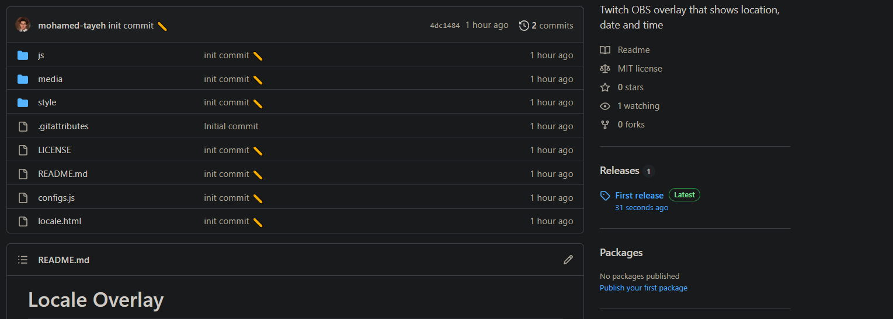
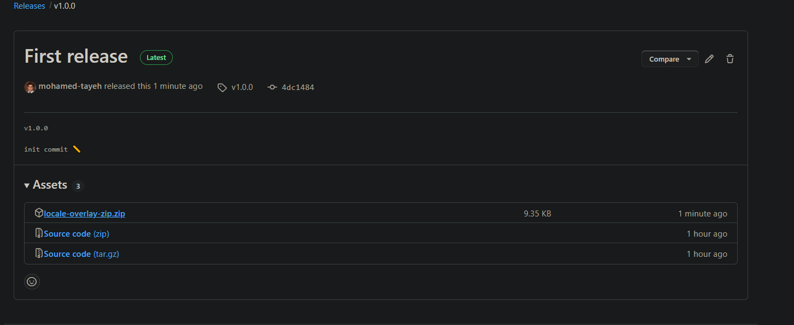
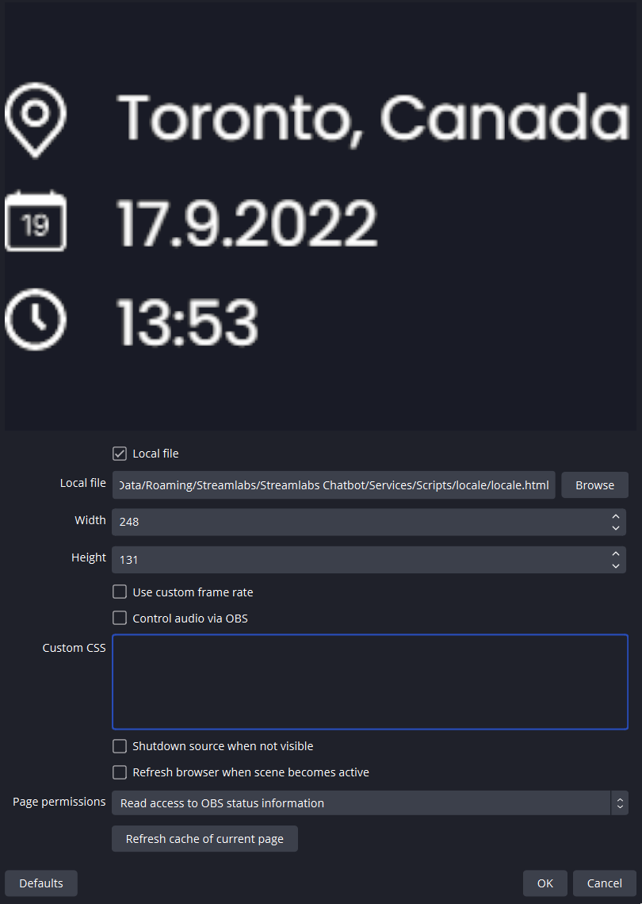

## Locale Overlay

This is the locale overlay that I use for my co-working Twitch stream.

Features:

1. Custom location: any text you want to write
2. Date: written in `dd.mm.yyyy`
3. Custom Time: shows `hh:mm:ss` or `hh:mm`
4. Custom fonts from [Google fonts], as well as font size and color
5. Custom images for location, date and time, as well as size
6. Custom background: color, opacity and roundness

## Installation

1. Download the zip to your desired location
   
   

2. Add a locale browser source
3. Choose `locale.html`
   

## Configuration

### Date Time formats

Date Formats:

```javascript
const dateFormat = 'dd.MM.yyyy';
```

- d.M.yyyy - 6.3.2023
- d.MM.yyyy - 6.03.2023
- dd.MM.yyyy - 06.03.2023
- dd MMM yyyy - 06 Mar 2023
- dd MMMM yyyy - 06 March 2023
- EEE dd MMM yyyy - Mon 06 March 2023

Language:

```javascript
const language = 'en';
```

- This would change the language of the widget.
- List of all locales [(column "639-1")](https://en.wikipedia.org/wiki/List_of_ISO_639-1_codes)
- E.g. french would be `fr`
- The date format of `EEE dd MMM yyyy` would be `Lun. 27 Mars 2023`

> Make sure you are chaning the height and widths for it not to overflow to the next lines.

Time Formats:

```javascript
const timeFormat = 'dd.MM.yyyy';
```

- HH:mm - 16:37
- HH:mm:ss - 16:37:46
- hh:mm a - 4:37 PM
- hh:mm - 4:37
- hh:mm ZZZZ - 4:37 EST

[All the date time tokens/formats](https://github.com/moment/luxon/blob/master/docs/formatting.md#table-of-tokens)

### Styling

Within the folder, find and open the file called `configs.js` using `notepad`.

The file should look like this with comments on how to change the default configurations:

### Images

1. Place your chosen images in the media folder.
2. Change `locationImg`, `dateImg` and `timeImg` in the `configs.js`, respectively.

## Credits

Please star the repository on the top right:) If you don't have an account, you can make one using your google account in under a minute!

If you would like to make a link for attribution, feel free to link this page or [my twitch stream].

[google fonts]: https://fonts.google.com/
[my twitch stream]: https://www.twitch.tv/mohfocus
